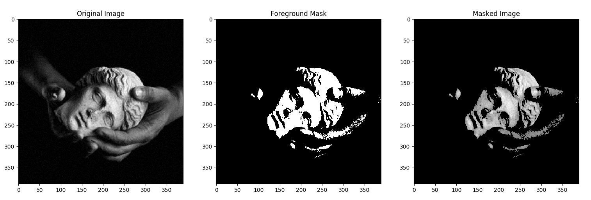
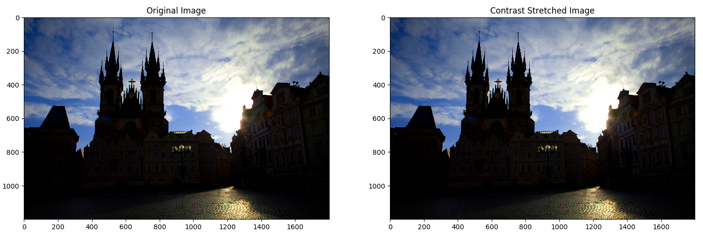
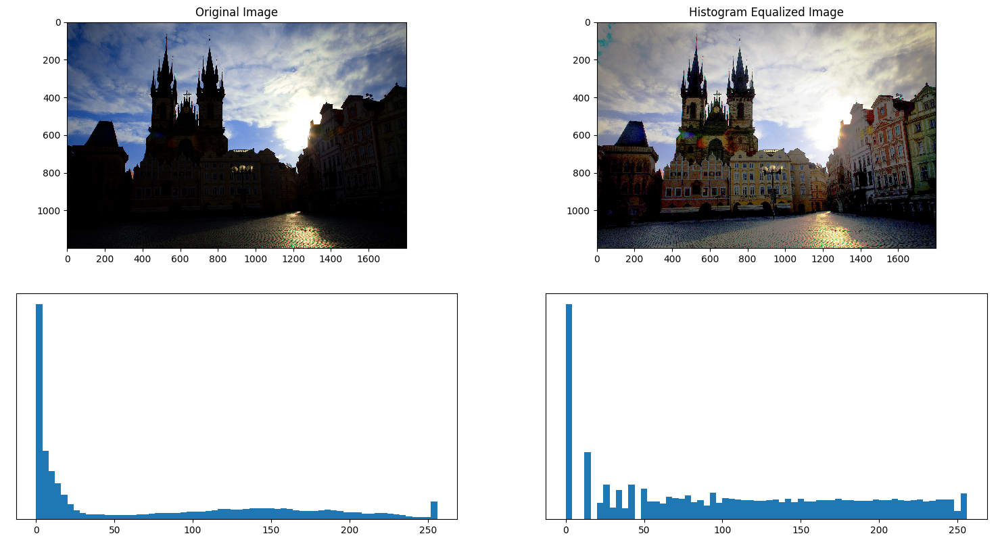
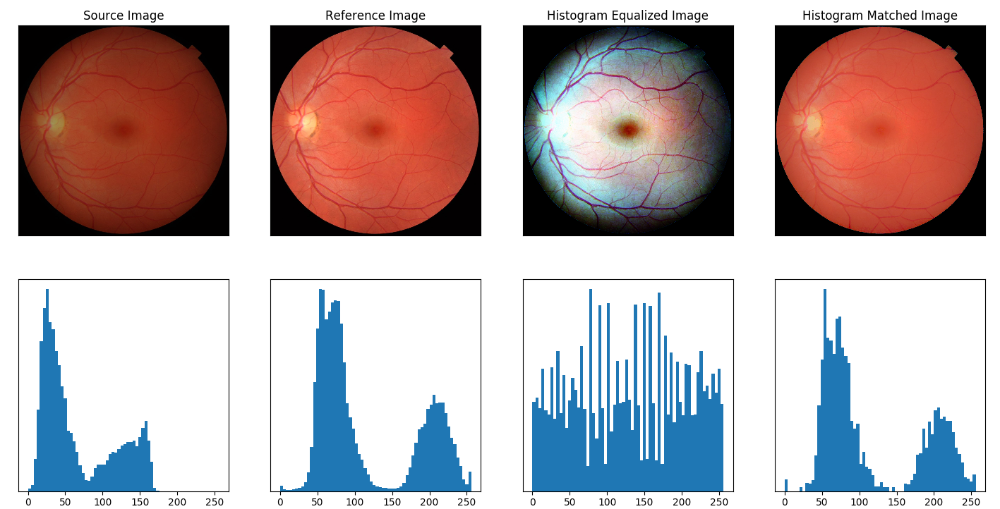
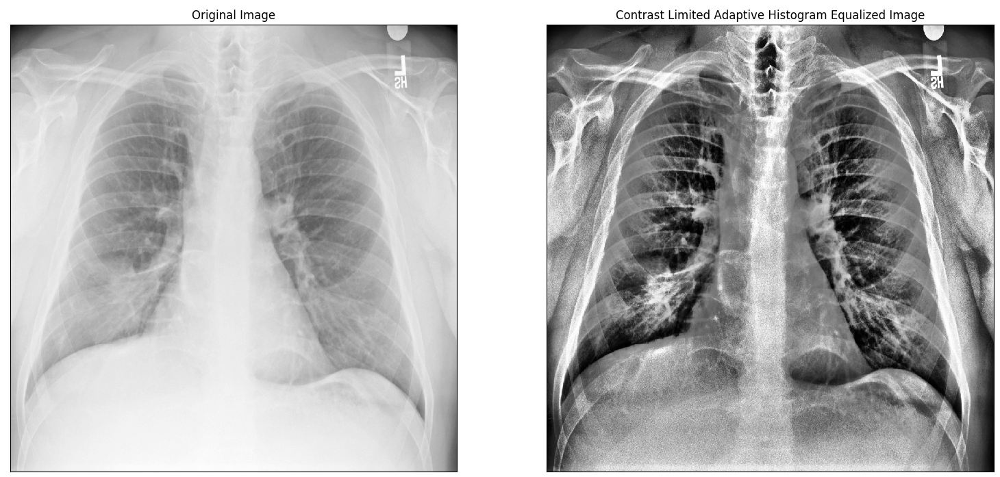
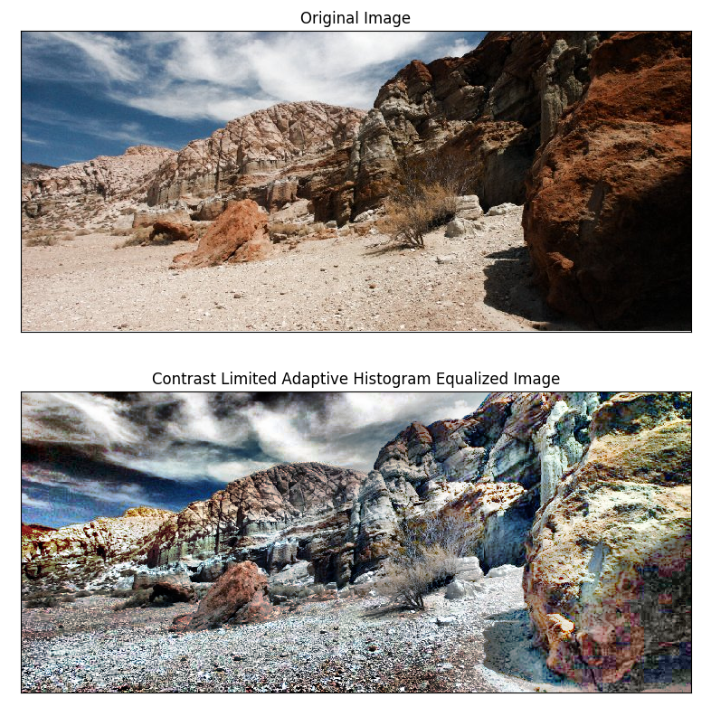

# CS663: Assignment 1 Question 2

This is the report for the 2$^{nd}$ question of the assignment. The team memebers are:
- Mohd Safwan
- Manas Vasishtha
- Sumrit Gupta

Question 2 was done by Mohd Safwan(17D070047) in Python3 using NumPy for matrix operations.

## Foreground Mask

The foreground mask is extracted by just applying a threshold filter with threshold $k$. We chose $k=60$ for our solution. It can be changed in the code easily.

T(r) = max(r, k)

  

##  Linear Contrast Stretching

Linear contrast stretching did not give very good results on these images because their contrast were already very widely spread. We used $max(I), min(I)$ for the contrast range. Results could be improved using top and bottom $5^{th}$ percentile of $I$ for the range. The following transformation was applied on image $I$.

T(r) = 255 * { r- min(I) }/{ max(I)-min(I) }

  

As we can see, contrast stretching is not very effective for the church image. It is because the there are many pixels with 0 intensity (shadow) and many with full intensity(sun), thus the contrast range is already streched.

## Histogram Equalization

  

Histogram Equalization stretches out the histogram of the image and makes it (approximately) constant. For the church image, HE is able to amplify the pixels with low intensity, thus making the image much more clear I prefer HE over contrast stretching judging by the visual quality of results.

## Histogram Matching

  

We can observe that the histogram of the source image is matched to the reference image. The images are now visually similar and have similar brightness.

## Contrast-Limited Adaptive Histogram Equalization
CLAHE is performed using the sliding window technique to compute the Probability Density Function efficiently. We found that usng threshold of 0.05 is good enough.

  

  

