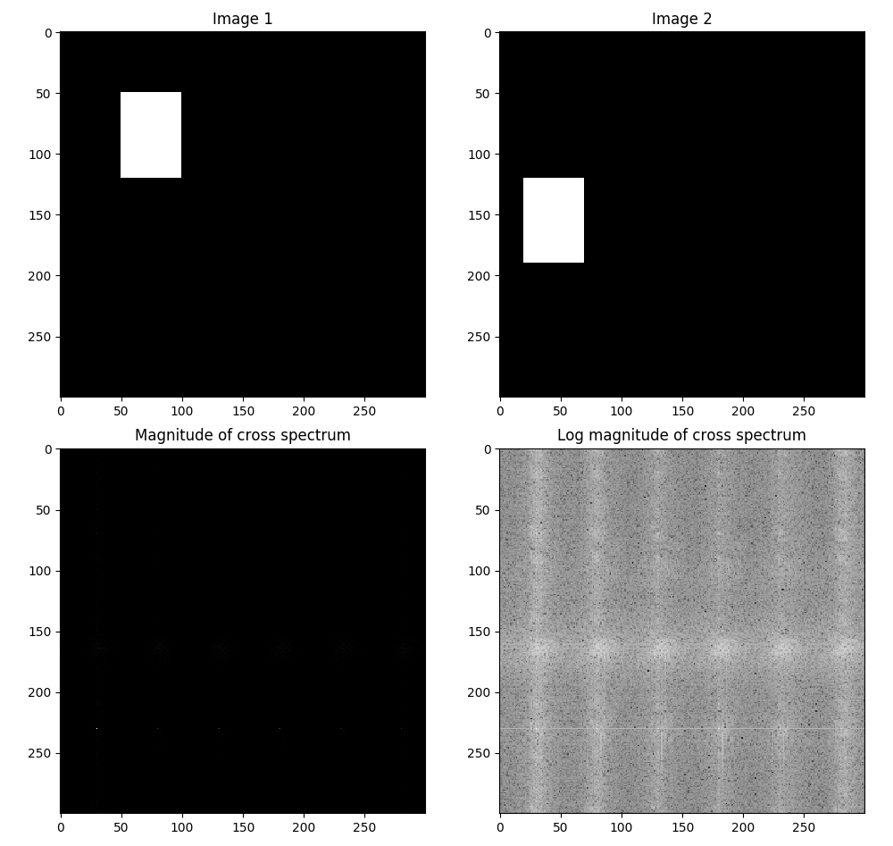
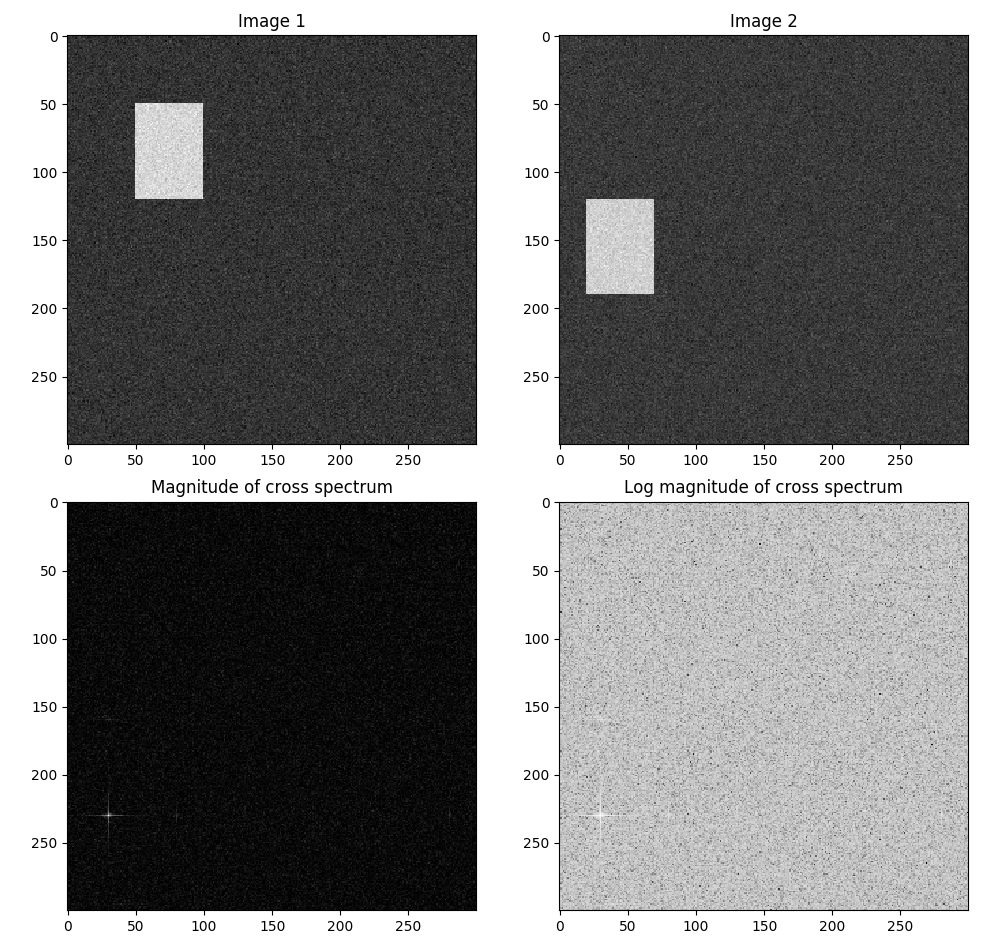

# Assignment 5 DFT: Question 6

We read the given paper *'An FFT-Based Technique for Translation, Rotation, and Scale-Invariant Image Registration'*. Equation 3 from the paper was implemented in Python 3 code to register 2 sets of images as described in the paper.

## Implementation
The following function implements the algorithm.

```python
def register_translation(a, b):
    assert a.shape == b.shape
    h, w = a.shape
    A = F.fft2(a)
    B = F.fft2(b)
    x_spec =  np.abs(F.ifft2((A * B.conjugate())/abs(A*B)))
    t_y, t_x = np.unravel_index(np.argmax(x_spec), (h, w))
    t_y = t_y-h if t_y > h//2 else t_y
    t_x = t_x-w if t_x > w//2 else t_x
    return t_x, t_y, x_spec
```

## Registraion without noise
The results without noise was $t_x = -30, t_y = 70$ which is correct.

{width=60%}

## Registraion with noise
The results obtained for the case with $N(0, 20)$ noise were $t_x = -30, t_y = 70$ which is correct.

{width=60%}

## Time Complexity

1D Discrete Time Fourier Transform on an array of length $n$ takes $\mathcal{O}(n\log{n})$ time with the FFT algorithm. For 2D FFT, we will first take DTFT row-wise and then column-wise (or vice versa), this will take $n\times \mathcal{O}(n\log{n}) + n\times \mathcal{O}(n\log{n})$ time, which is ultimately **$\mathcal{O}(n^2\log{n})$**.

On the other hand, for brute-force pixel wise comparison, it would take $\mathcal{O}(n^4)$ time for comparison in each possible translation. There are $n^2$ possible translations. Therefore, the time taken for this would be **$\mathcal{O}(n^4)$**
